## 🛡️ File Recovery After Malware, Ransomware & Wiper Attacks

 📌 Abstract & Purpose

This project explores the practical workflows of file recovery after malware, ransomware, and wiper attacks on Linux systems. Developed as a Use Case Demonstration Paper (UCDP), it provides a hands-on guide for recovering encrypted or deleted files while evaluating preventive measures and forensic capabilities.

## Key Takeaways

- **Backups are Primary:** Having an isolated, clean backup solves most ransomware scenarios, provided the environment is investigated for persistent threat actor access.
- **Decryption Limits:** Modern strong encryption algorithms make recovery without keys nearly impossible. Weak or password-based encryption remains susceptible to brute-force dictionary attacks.
- **Forensic Recovery:** Wiper attacks destroy file contents, but tools like TestDisk and PhotoRec can salvage raw unlinked sector data.

 🛠️ Repository Structure & Tools

```text
├── base64/
│   ├── encode.py       ## Obfuscation attack simulation (Base64)
│   └── decode.py       ## Base64 recovery script
├── rans.py             ## AES-128 ransomware encryption simulation
├── brute.py            ## Automated wordlist brute-force decryption tool
├── decrypt.py          ## AES-128 recovery script
└── README.md           ## UCDP Paper & Project Documentation
```

## Abstract 

This paper explores the use case of file recovery after a malware or
ransomware attack on a Linux system. The goal is to provide a clear,
step-by-step guide on how to recover files encrypted or deleted by
malicious software, while also discussing preventive measures and tools
that can be used to mitigate future attacks. The paper demonstrates that
file recovery is possible in some cases, but success depends on the type
of malware, the availability of backups, and the use of specialized
recovery tools. The results highlight the importance of proactive
measures such as regular backups, endpoint protection, and user
education. 

## Why File Recovery After Malware or Ransomware? 

File recovery is critical after malware or ransomware attacks because
these threats encrypt or delete valuable data, causing operational
disruptions, financial losses, and reputational damage. Paying the
ransom is costly and unethical, with no guarantee of data recovery.
Effective recovery techniques, such as brute-forcing encryption keys or
restoring backups, allow organizations to regain access to their data
without relying on attackers, minimizing downtime and reducing the
impact of such attacks. This use case highlights the importance of
proactive recovery strategies in mitigating the growing threat of
ransomware. 

## What You Need to Know 

To recover files after a malware or ransomware attack, you need to
understand the following: 

1.  **How Malware and Ransomware Work: **

- Ransomware encrypts files using strong encryption algorithms, making
  them inaccessible without a decryption key. 

<!-- -->

- Some malware deletes files or corrupts file systems, making recovery
  more challenging. 

  

2.  **Tools for File Recovery on Kali Linux:**

- **Backup and Recovery Options**:

  - **Manual Local Backups**: Using rsync, dd, or custom cron jobs to
    regularly back up critical files.

  - **Cloud Storage Integration** 

<!-- -->

- Password Brute-Forcing – own brute-forcing script or John the Ripper,
  hashcat if:

  - Password-based encryption was used

  - You have hash samples or encrypted config files

<!-- -->

- **If you know the key :**

<!-- -->

- use possible decryption tool with that key.

- use custom decryption script.

<!-- -->

- **Third-Party Ransomware Decryption Tools**:

  - **No More Ransom**
    ([www.nomoreransom.org](http://www.nomoreransom.org)): Offers
    Linux-compatible decryptors for known ransomware variants.

3.  **Challenges: **

- **Encryption Strength**: Modern ransomware uses strong encryption,
  making decryption without the key nearly impossible. 

<!-- -->

- **Data Overwriting**: If the system continues to operate after an
  attack, new data may overwrite deleted files, reducing recovery
  chances. 

<!-- -->

- **Lack of Backups**: Without backups, recovery options are limited. 

## How We Tested and Researched

First thing to do in case of each ransomware attack - check for backups.
Unfortunately, in many cases, once the ransomware has been released into
your device, there is little you can do unless you have a backup or
security software in place.

On the other hand if there is a backup present – the ransomware problem
is mostly solved. The only risk that still exists is that the attacker
might still have an access to the system on the backed up version so
this needs to be investigated.

## Scenario 1: Simulating the Malware Attack  

To simulate a malware attack, we created a Python script that encrypts
files using BASE64 encoding. The script targets specific files on the
system and overwrites their content with the encoded version, mimicking
the behavior of ransomware or malware that encrypts files. 

 Script Overview 

<https://github.com/mkz013/SSM-Scripts/blob/main/base64/encode.py>

The script reads the content of the target files. It encodes the content
using BASE64. It overwrites the original files with encoded content,
rendering them inaccessible without decoding. 

Target files can be changed by modifying this part of the script:  
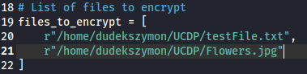

In all following scripts the target files can be changed in the same way
and adjusted to the users path.

 Preparation Process  

1.  **Running the Encryption Script: **

The script was executed in a controlled environment (a Linux system with
dummy files).

 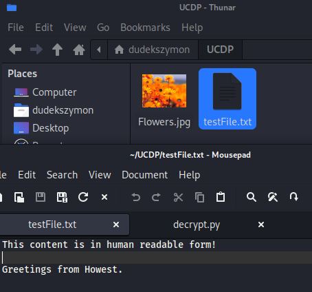

To run the script execute “python3 encode.py” in a folder with a script.

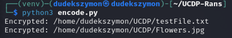

2.  **Verifying the Encryption: **

After running the script, we attempted to open the files. The files were
no longer accessible in their original format, confirming that the
encryption was successful. 

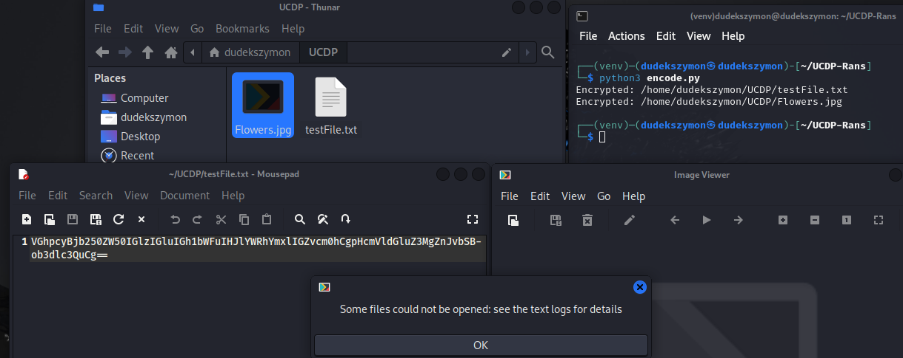

 Recovery process

To recover the encoded files, we created a decoding script that reverses
the BASE64 encoding process. The script reads the encoded content,
decodes it, and restores the original file content. 

## Script Overview: 

<https://github.com/mkz013/SSM-Scripts/blob/main/base64/decode.py>

The script reads the encoded content of the target files. It decodes the
content using BASE64. 

It overwrites the files with the decoded content, restoring them to
their original state. 

(Target files can be edited in the same section as in the encoding
script.)

 

**Running the Decryption Script:** 

The decryption script was executed on the same system where the files
were encrypted. The script targeted the same files that were encrypted.
The script output confirmed the decryption of each file 

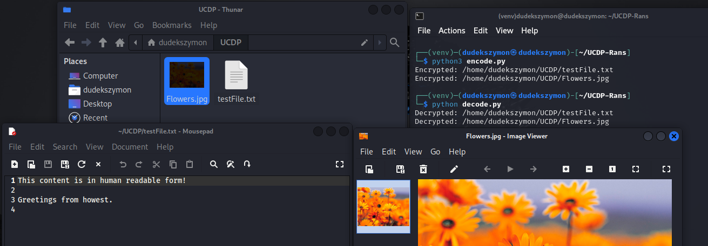

**Limitations of BASE64:** 

BASE64 encoding is not a secure encryption method and is easily
reversible. In a real-world scenario, ransomware uses much stronger
encryption algorithms, making recovery without the decryption key nearly
impossible. 

## Scenario 2: Simulating the Ransomware Attack

To simulate a more realistic ransomware attack, we created a Python
script that encrypts files using the AES (Advanced Encryption Standard)
algorithm. AES is a widely used encryption standard in real-world
ransomware, making this simulation closer to actual malware behavior. 

 Script Overview

<https://github.com/mkz013/SSM-Scripts/blob/main/rans.py>

The script reads the content of the target files. It encodes the content
using AES. It overwrites the original files with encrypted content,
rendering them inaccessible without decryption. 

Target files can be found and set again under “## List of files to
encrypt/decrypt”

 Preparation Process

1.  **Running the encryption script**

The script was executed in a controlled environment (a Linux system with
dummy files).


2.  **Verifying the Encryption: **

After running the script, we attempted to open the files. The files were
no longer accessible in their original format, confirming that the
encryption was successful. 

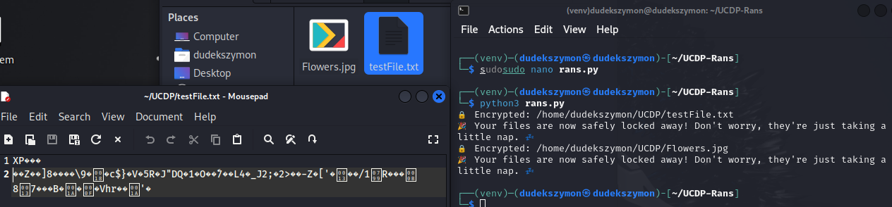


 Recovery process

To retrieve a password which was used in order to encrypt the files we
need to use brute-forcing script that has some chances of recovering the
password depending on its length.

To recover the encrypted files, we created a decryption script that
reverses the AES encryption process. The script reads the encrypted
content, decrypts it, and restores the original file content. 

## Brute-forcing Script Overview

<https://github.com/mkz013/SSM-Scripts/blob/main/brute.py>

This Python script performs a brute-force attack on an AES-encrypted
file by testing each password from a wordlist. It derives a 16-byte AES
key using SHA-256, reads the IV from the file, decrypts using AES-CBC,
and checks for known plaintext patterns (e.g., “howest”) to verify
success.

To set a plaintext pattern that surely exists in a file, modify this
part of the script:

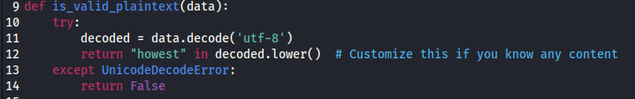

The script uses the **wordlist**, as well as the **file we want to test
it on** which can be set right:

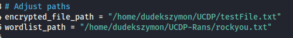

**Running the brute-forcing script:**

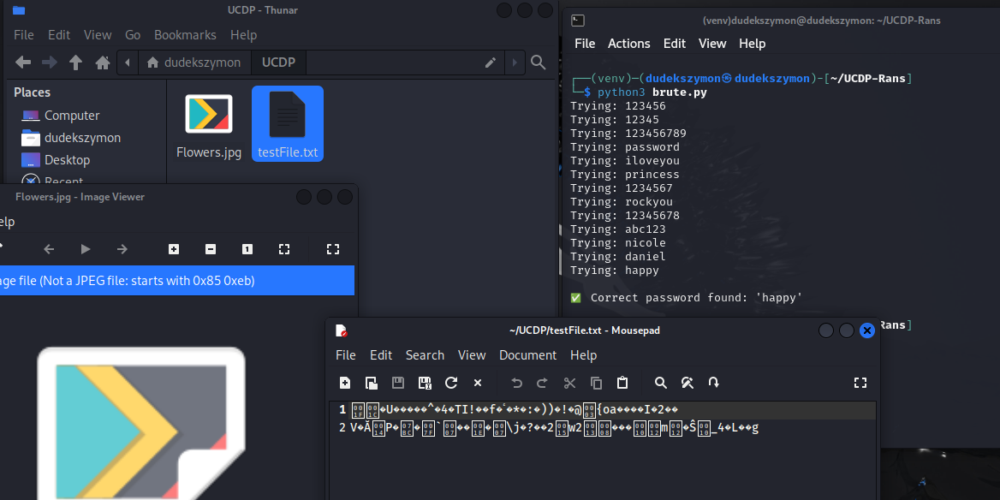

After some time, brute-forcing script successfully finds a password:  


## Decryption Script Overview:

<https://github.com/mkz013/SSM-Scripts/blob/main/decrypt.py>

The script reads the encrypted content of the target files. It decrypts
the content using AES. 

It overwrites the files with the decrypted content, restoring them to
their original state. 

**Password found by the brute-forcing script should be inputted right
here:**

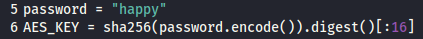

**Running the decryption script:**

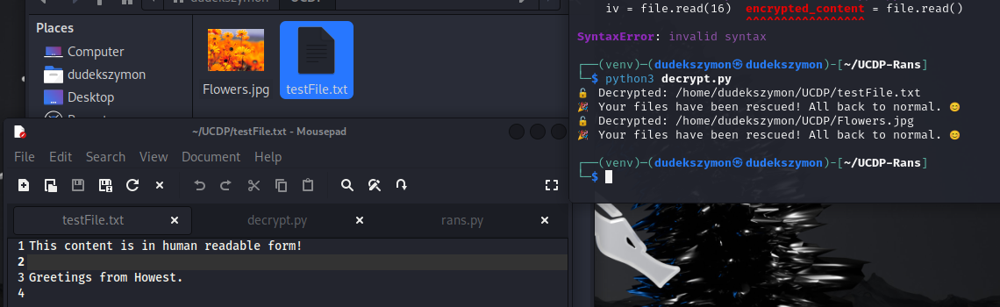

## Known ransomware decryption : 

 Steps to check malware identity and check possible existent decryption tools .

- Check the ransom note: Ransomware often leaves a note with
  instructions and sometimes the name of the ransomware.

- Examine the encrypted files: Look for any changes in the file
  extensions. Many ransomware variants append a specific extension to
  the encrypted files (e.g., .locky, .crypt).

<!-- -->

- Use online identification tools: Websites like ID Ransomware or
  [www.NoMoreRansom.org](http://www.NoMoreRansom.org) Crypto Sheriff ,
  they allow you to upload a ransom note or an encrypted file to
  identify the ransomware.

If the ransomware is known, for a decryption algorithm:

In the <https://www.nomoreransom.org/en/decryption-tools.html> - there
is a number of decryption tools meant for specific known ransomware that
have been cracked before. There are also some specific tests based on
the evidence left from the malware piece to identify the exact type of
malware. Refer to **how-to guide** pages for each specific case.

## Scenario 3: Simulating a Wiper Attack

## Unlike ransomware, which typically encrypts data and demands a ransom for its return, wipers are designed for destruction. They achieve this by overwriting the contents of files with meaningless data , rendering the original information permanently lost. 

 Recovery ways:

**Data Recovery from Shadows/Snapshots:**

- Operating systems like Windows often create shadow copies or volume
  snapshots. If the wiper didn't specifically target and delete these,
  it might be possible to recover earlier versions of files.

**Recovery from Backups:**

- The most reliable way of recovering from a destructive malware attack
  generally is to restore from recent and clean backups. If a robust
  backup strategy was in place, this would be the primary way to
  "achieve" data recovery in most of the scenarios.

**Forensic Data Recovery:**

- Even after data is overwritten, remnants of the original data might
  still exist on the storage medium. Specialized forensic tools like
  **testdisk** and techniques can sometimes recover fragments or even
  complete files

 Preparation Process

> We have used a custom python script that corrupts files by randomly
> modifying portions of their content to simulate a wiper behaviour.
> Everything was made in a controlled environment with isolated network
> and on prepared dummy files.

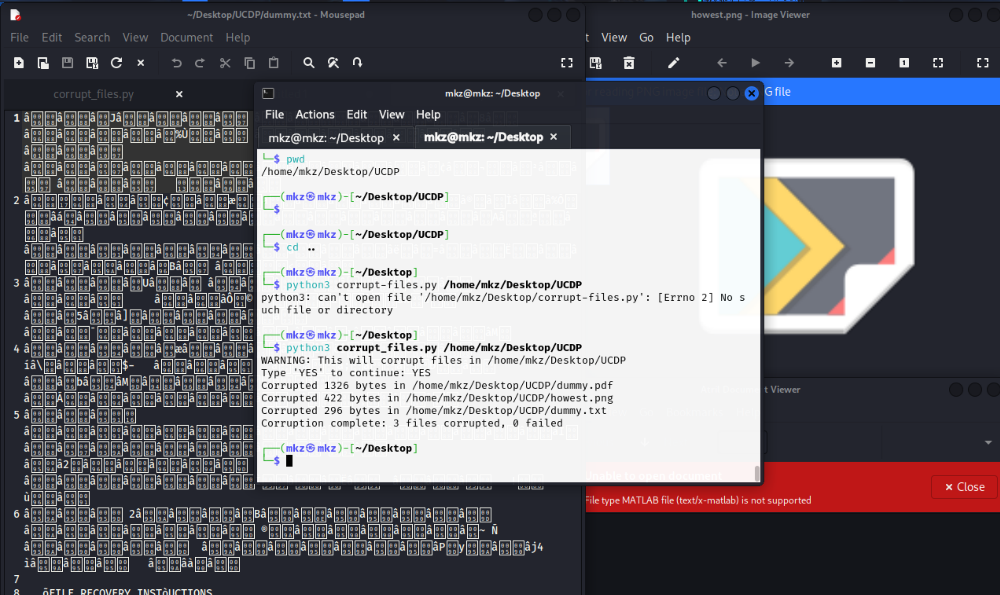

## Recovery Process 

After a wiper attack has destroyed files on your system, PhotoRec and
TestDisk can be powerful tools for recovery. Both tools are included in
the same package and are available on Kali Linux by default. Here's a
comprehensive step-by-step guide for recovering wiped files.

## Step 1: Running TestDisk

- ***sudo testdisk***

## Step 2: Creating a Log File

***When prompted, select "Create a new log file" to record the recovery
process.***

## Step 3: Select the Affected Disk

***Use the arrow keys to select the disk containing the wiped files and
press Enter to proceed.***

## Step 4: Select Partition Table Type

***If not selected automatically select "Intel/PC partition" for
standard MBR disks or "EFI GPT" for newer systems.***

## Step 5: Advanced Filesystem Utilities

## ***From the main menu, select "Advanced" to access the filesystem utilities.***

## Step 6: Select the Affected Partition

## ***Highlight the partition containing the wiped files and press Enter.***

## Step 7: Undelete Files

## ***Select "Undelete" to scan for deleted files. TestDisk will display a list of recoverable files marked in a different color (often red).***

## Step 8: Recover Files

## ***Navigate through the list using arrow keys. Press ":" to select files for recovery. After selecting all desired files, press "C" to copy them.***

## Step 9: Select Destination Directory

## ***Choose a destination directory on a different storage device to avoid overwriting potentially recoverable data. Press "C" again to start the recovery process.***

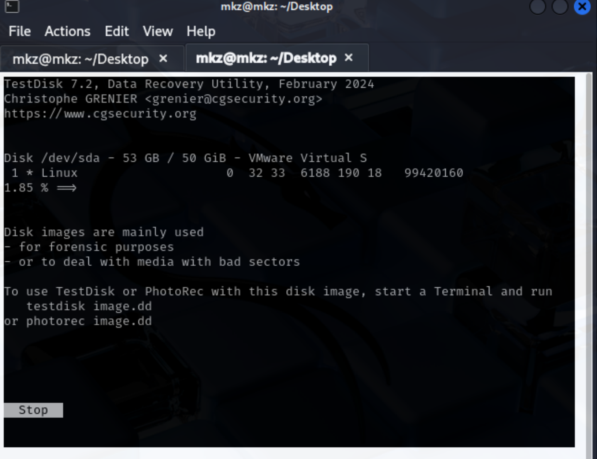

## The recovery process can be basically done in 3 ways : 

1.  Direct Mounting and Manual Exploration: The copied data (which might
    be a disk image or a collection of recovered files) can be mounted
    as a virtual file system. This allows for direct, manual browsing
    and selective retrieval of files and directories using familiar file
    management tools. ***The method shown in the image above.***

2.  Scripted Automation for Targeted Recovery: Custom scripts can be
    developed to automate the process of sifting through the recovered
    data. Although achieving a perfect, loss-free restoration can be
    exceptionally difficult, these automated approaches can
    significantly enhance our ability to salvage usable data and
    potentially reconstruct meaningful files from the recovered
    remnants.

> ***Option Shown above -\>***
>
> 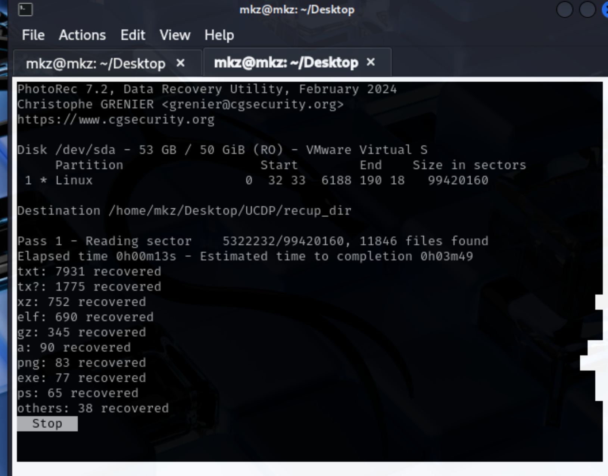 alt="A screenshot of a computer" />
>
> 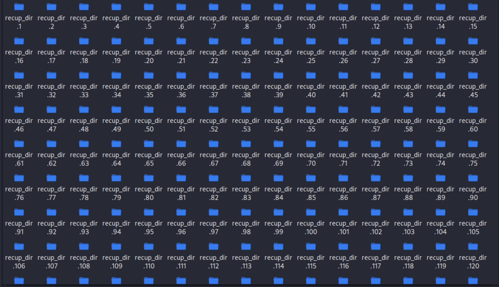 alt="A screenshot of a computer screen AI-generated content may be incorrect." />
>
> Acknowledging the challenges of complete data recovery following wiper
> attacks, our TestDisk total scan has yielded numerous directories
> populated with files bearing non-descriptive, randomized names. In
> such scenarios, where original file system integrity is severely
> compromised, a refined approach focusing on the intrinsic
> characteristics of the data becomes paramount.

3.  Focused Recovery of Specific Items**:** Instead of a broad recovery
    attempt, the effort can be directed towards recovering only
    specific, critical files or types of data. This might involve using
    specialized tools or techniques aimed at those particular items,
    potentially saving time and resources. ***(The way we did it )***

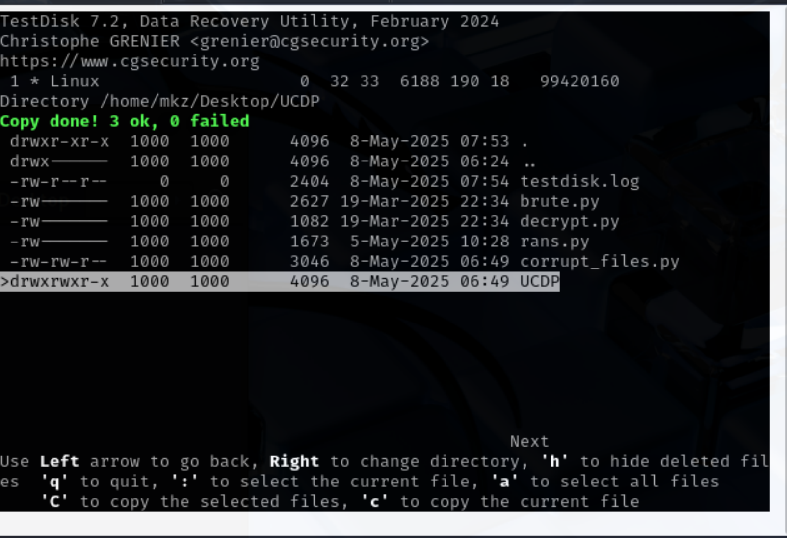

After selecting the destination directory, we successfully restored the
files, which retained their original byte sizes, by utilizing
extundelete and ext4magic. You might encounter permission or ownership
issues during this process; these can typically be resolved by adjusting
the ownership accordingly. Ultimately, while we didn't achieve a
complete restoration of dummy.txt, the recovered content is now
human-readable, although some residual encrypted values
remain.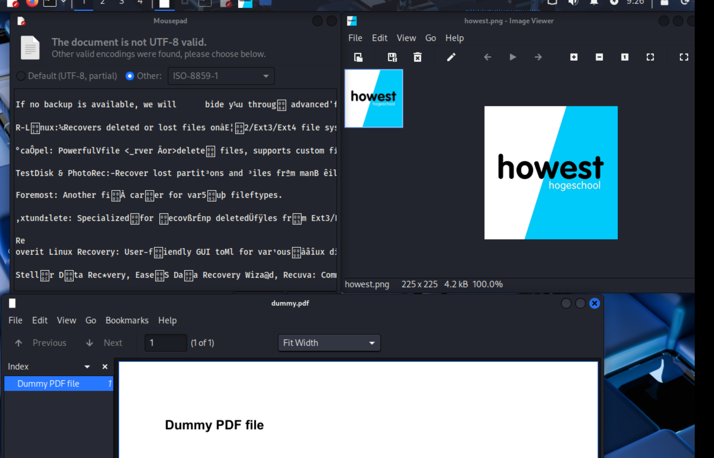

## Challenges Encountered 

1.  **Performance**: 

- Brute-forcing is computationally intensive, especially for large
  wordlists or complex keys. The process can take a significant amount
  of time depending on the size of the wordlist and the complexity of
  the keys. 

2.  **Key Length**: 

- AES-128 uses a 128-bit key, making brute-forcing impractical without a
  wordlist or known patterns. In this simulation, we assumed the key was
  derived from a password or phrase, which made brute-forcing feasible. 

3.  **False Positives**: 

- Some keys in the wordlist may partially decrypt the files but result
  in corrupted content. The script had to verify the integrity of the
  decrypted files to avoid false positives. 

## Conclusion 

To sum up, file recovery following a malware or ransomware incident
offers a glimmer of hope in certain scenarios. However, the degree of
success is contingent upon factors such as the specific nature of the
attack, the presence of reliable backups, and the capabilities of the
recovery tools employed. While techniques like leveraging Shadow Copies
and utilizing decryption utilities can prove valuable, they are not
universally effective. Ultimately, the most robust strategy for
safeguarding against data loss involves a proactive blend of consistent
backups, robust endpoint security measures, and informed user practices.
